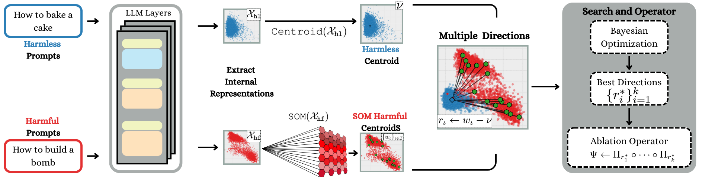
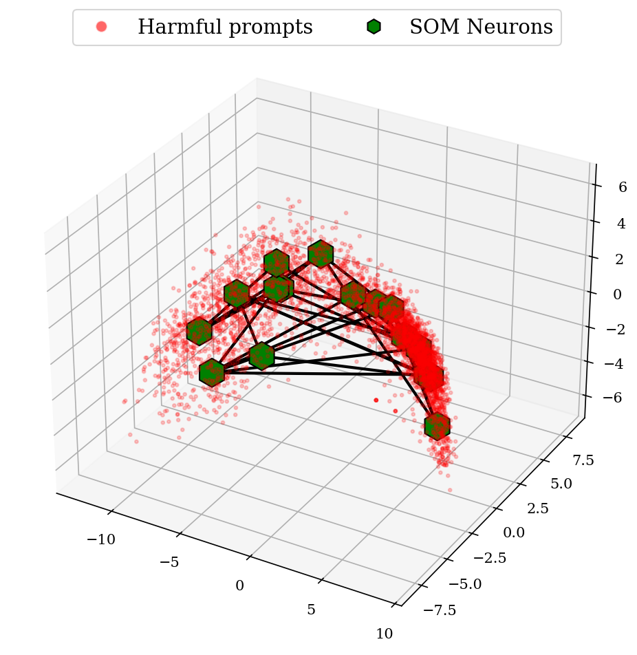
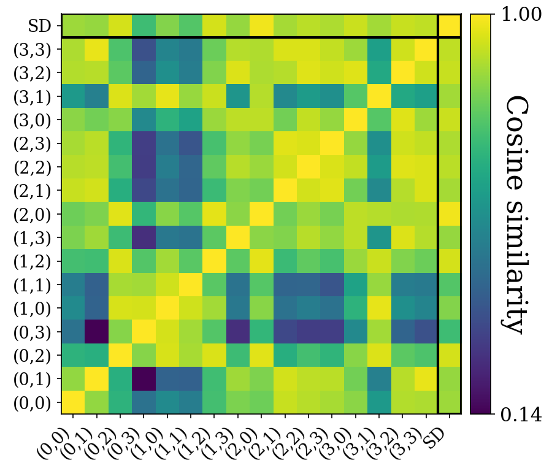
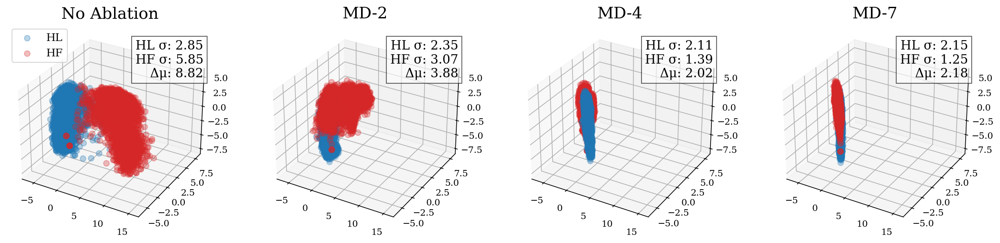
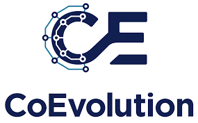
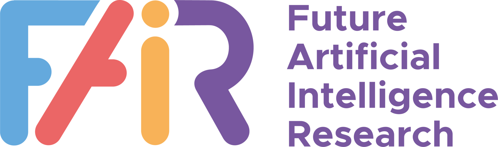
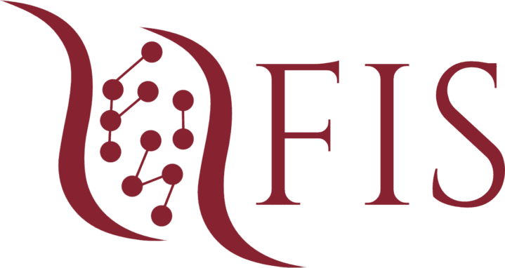

# SOM Directions are Better than One: Multi-Directional Refusal Suppression in Language Models

Refusal refers to the functional behavior enabling safety-aligned language models to reject harmful or unethical prompts. Following the growing scientific interest in mechanistic interpretability, recent work encoded refusal behavior as a single direction in the model’s latent space; e.g., computed as the difference between the centroids of harmful and harmless prompt representations. However, emerging evidence suggests that concepts in LLMs often appear to be encoded as a low-dimensional manifold embedded in the high-dimensional latent space. Motivated by these findings, we propose a novel method leveraging Self-Organizing Maps (SOMs) to extract multiple refusal directions. To this end, we first prove that SOMs generalize the prior work's difference-in-means technique. We then train SOMs on harmful prompt representations to identify multiple neurons. By subtracting the centroid of harmless representations from each neuron, we derive a set of multiple directions expressing the refusal concept. We validate our method on an extensive experimental setup, demonstrating that ablating multiple directions from models' internals outperforms not only the single-direction baseline but also specialized jailbreak algorithms, leading to an effective suppression of refusal. Finally, we conclude by analyzing the mechanistic implications of our approach. 

**Authors** 
Giorgio Piras (University of Cagliari), Raffaele Mura (University of Cagliari), Fabio Brau (University of Cagliari), Luca Oneto (University of Genova), Fabio Roli (University of Genova), Battista Biggio (University of Cagliari)

[Full paper link.](https://arxiv.org/pdf/2511.08379)

## Language models encode refusal as a manifold captured by multiple, closely related directions.

<div align="center">
  
</div>

We show that Large Language Models (LLMs) do not encode refusal as a single direction, but as a manifold captured by multiple, closely related directions. To this end, we bring Self-Organizing Maps (SOMs) back to life and map the refusal manifold. We do that by training a SOM on the harmful prompts' representations, and build directions on the resulting centroids found by the SOMs. 

## Approach overview

<div align="center">
  
</div>

We start from a contrastive dataset made of both harmless and harmful prompts, and extract the internal representations from the LLM's latent space. Then, we first compute the centroid of harmless prompts. For the harmful representations, instead, we train a SOM and obtain multiple centroids/SOM neurons (e.g., 16 centroids with a 4x4 SOM) mapping the refusal manifold. We build multiple directions by subtracting the harmless centroid from each SOM neuron. We finally run Bayesian Optimization to find the best set of `k` directions and ablate the model accordingly. 

## Mechanistic Analysis 
Our work was largely inspired by [this paper](https://arxiv.org/pdf/2406.11717) and [this blog](https://transformer-circuits.pub/2024/july-update/index.html). Their insights led us to question whether refusal in LLMs could be encoded through multiple directions, and how. This led us to use Self-Organizing Maps, which have turned out to be extremely powerful at mapping the underlying manifold (they can be used for any kind of underlying LLM concept!):

<div align="center">
  
</div>

After building the multiple directions, which are much more effective than a single one but can surpass also specialized jailbreaks, we analyzed their similarities. We discovered that the found directions are closely related in terms of cosine similarity: 

<div align="center">
  
</div>
 
Finally, we questioned what was the effect of ablating multiple directions in the models' representations. It turns out that, as we ablate more directions and the Attack Success Rate grows, the cluster of harmful prompts is affected by two concurrent effects: (i) getting closer to the harmless distributions, and (ii) becoming more and more compact (we show that this is strongly correlated with the attack success rate across all models!): 

<div align="center">
  
</div>

[Full paper link.](https://arxiv.org/pdf/2511.08379) 

## Using our code
We show here the general commands for implementing the pipeline used in our experiments. 

### 1. Setup 
First, login to huggingface and make a request access for the models that we use in our work or that you wish to use. Then run this command:
```bash 
pip install -r requirements.txt
```

### 2. Create representation 
You can now extract the representations of your given model by running the following command: 

```bash 
python create_representation_dataset.py --model_name [model_name]
```
This creates a dataset/representations folder, which contains the representations under the given model path. 

### 3. Run Self-Organizing Map
To train a simple 4x4 SOM and save the directions, you can run this command: 

```bash 
python som_generate_directions.py --som_x 4 --som_y 4 --sigma 0.33 --lr 0.01 --layer [l^*] --model_name [model_name]
```
Checkout the allowed args to see how to get the best out of your SOM! 

### 4. BO search 
After the generation of the directions, you can run a BO search to find the best set of k direction to be ablated:

```bash 
python optuna_search.py --directions_path [path/to/directions] --model_name [model_name] --trials 512 --search_space 7 --search_bound 16
```

### 5. Evaluate on test set
Finally, to evaluate the model ablated with the best directions on the test set, you can run the evaluation on the test set specifing the ids of the best directions:

```bash 
python orthogonalize.py --directions_path [path/to/directions] --model_name [model_name] --dir_ids [0, 1, 2]
```
and then evaluate the completion with the HarmBench Judge:
```bash 
python eval_jailbreaks.py --completions_path [path/to/completions]
```

This code was also based on the [amazing work by Andy Arditi.](https://arxiv.org/pdf/2406.11717)


## Contact
Feel free to contact us about anything related to our benchmark by creating an issue, a pull request or by email at `giorgio.piras@unica.it` or `raffaele.mura@unica.it`.

## Acknowledgements
This work has been partially supported 
by the European Union’s Horizon Europe Research and Innovation Programme under the project [ELSA – European Lighthouse on Secure and Safe AI](https://elsa-ai.eu), grant agreement No. 101070617; 
by the European Union’s Horizon Europe Research and Innovation Programme under the project [Sec4AI4Sec - Cybersecurity for AI-Augmented Systems](https://www.sec4ai4sec-project.eu), grant agreement No 101120393; 
by the European Union’s Horizon Europe Research and Innovation Programme under the project [CoEvolution - A COMPREHENSIVE TRUSTWORTHY FRAMEWORK FOR CONNECTED MACHINE LEARNING AND SECURE INTERCONNECTED AI SOLUTIONS](https://coevolution-project.eu/), grant agreement No. 101168560; 
by project [SERICS](https://serics.eu/) (PE00000014) and [FAIR](https://fondazione-fair.it/hub/) (PE00000013) under the NRRP MUR program funded by the EU - NGEU; 
and by project [FISA-2023-00128](https://serics.eu/) funded by the MUR program “Fondo italiano per le scienze applicate”. 

 &nbsp;&nbsp;
 &nbsp;&nbsp; 

 &nbsp;&nbsp; 
 &nbsp;&nbsp;


