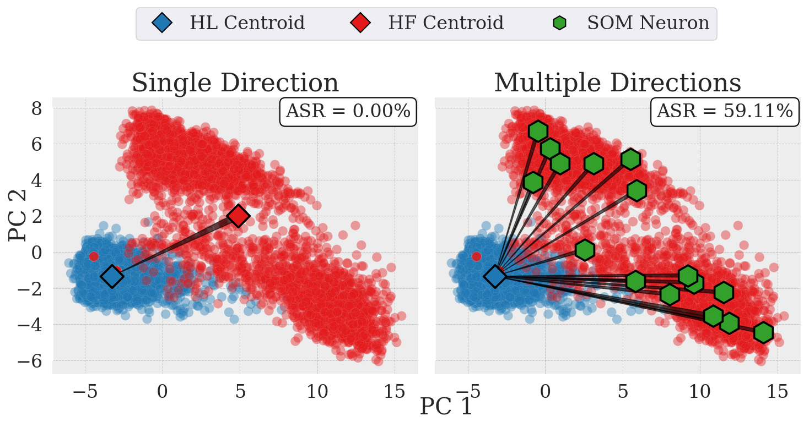

[](https://arxiv.org/abs/2409.01249)

# SOM Directions are Better than One: Multi-Directional Refusal Suppression in Language Models

Refusal refers to the functional behavior enabling safety-aligned language models to reject harmful or unethical prompts. Following the growing scientific interest in mechanistic interpretability, recent work encoded refusal behavior as a single direction in the model’s latent space; e.g., computed as the difference between the centroids of harmful and harmless prompt representations. However, emerging evidence suggests that concepts in LLMs often appear to be encoded as a low-dimensional manifold embedded in the high-dimensional latent space. Motivated by these findings, we propose a novel method leveraging Self-Organizing Maps (SOMs) to extract multiple refusal directions. To this end, we first prove that SOMs generalize the prior work's difference-in-means technique. We then train SOMs on harmful prompt representations to identify multiple neurons. By subtracting the centroid of harmless representations from each neuron, we derive a set of multiple directions expressing the refusal concept. We validate our method on an extensive experimental setup, demonstrating that ablating multiple directions from models' internals outperforms not only the single-direction baseline but also specialized jailbreak algorithms, leading to an effective suppression of refusal. Finally, we conclude by analyzing the mechanistic implications of our approach. 

**Authors** 
Giorgio Piras (University of Cagliari), Raffaele Mura (University of Cagliari), Fabio Brau (University of Cagliari), Luca Oneto (University of Genova), Fabio Roli (University of Genova), Battista Biggio (University of Cagliari)

## Language models encode refusal as a manifold captured by multiple, closely related directions.

<div align="center">
  
</div>

We show that Large Language Models (LLMs) do not encode refusal as a single direction, but as a manifold captured by multiple, closely related directions. To this end, we bring Self-Organizing Maps (SOMs) back to life and map the refusal manifold. We do that by training SOMs on the harmful prompts' representations, and build directions on the centroids found by the SOMs. 


### Setup 
First, login to huggingface and make a request access for the models that we use in our work. Then run this command:
```bash 
pip install -r requirements.txt
```

### Create representation 
You can now extract the representations of your given model by running the following command: 

```bash 
python create_representation_dataset.py --model_name [model_name]
```
This creates a dataset/representations folder, which contains the representations under the given model path. 

### Run Self-Organizing Map
To train a simple 4x4 SOM and save the directions, you can run this command: 

```bash 
python som_generate_directions.py --som_x 4 --som_y 4 --layer 13 --sigma 0.33 --lr 0.01 --layer [l^*] --model_name [model_name]
```
Checkout the allowed args to see how to get the best out of your SOM! 

### BO search 
After the generation of the directions, you can run a BO search to find the best set of k direction to be ableated:

```bash 
python optuna_search.py --directions_path [path/to/directions] --model_name [model_name] --trials 512 --search_space 7 --search_bound 16
```

### Evaluate on test set
Finally, to evaluate the best set of directions on the test set, you can run the evaluation on the test set specifing the ids of the best directions:

```bash 
python orthogonalize.py --directions_path [path/to/directions] --model_name [model_name] --dir_ids [0, 1, 2]
```
and then to evaluate with the HarmBench Judge:
```bash 
python eval_jailbreaks.py --completions_path [path/to/completions]
```